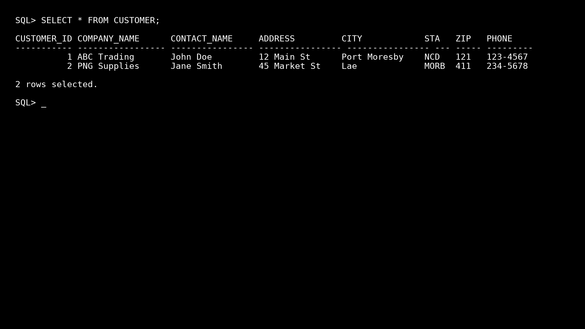

## Project 1 – Customer Database Management

## Objective

The objective of this project is to demonstrate the creation, management, and querying of a CUSTOMER table using Oracle 19c.
This project focuses on database design, SQL query execution, and verifying results.

## Tools

Oracle SQL 19c – for database creation, management, and querying

SQL Scripts – .sql files used to create tables and execute queries

## What I Built

Created a CUSTOMER table with the following columns:
CUSTOMER_ID, COMPANY_NAME, CONTACT_NAME, ADDRESS, CITY, STATE, ZIP, PHONE

Wrote SQL scripts to:

Insert records

Update records

Retrieve data using SELECT statements

Verified outputs in Oracle 19c to ensure the database was correctly set up and queries returned the expected results.

## Files
File Name	Description
customer_table_creation.sql	SQL script to create the CUSTOMER table
customer_queries.sql	SQL scripts for inserting, updating, and querying data
oracle_dark_theme_pc_output_blinking_cursor.png	Screenshot of the SQL query output in Oracle 19c

## How to Run

Open Oracle SQL Developer or SQL*Plus.

Run customer_table_creation.sql to create the CUSTOMER table.

Run customer_queries.sql to insert data and perform queries.

Verify the output in Oracle 19c by checking the results (refer to the screenshot below).

Screenshots

## 📸 Oracle 19c Output Screenshot

Below is the actual output from Oracle 19c for the CUSTOMER table query executed in Project 1.  
It shows that the database was correctly created and the SQL queries return the expected results.

